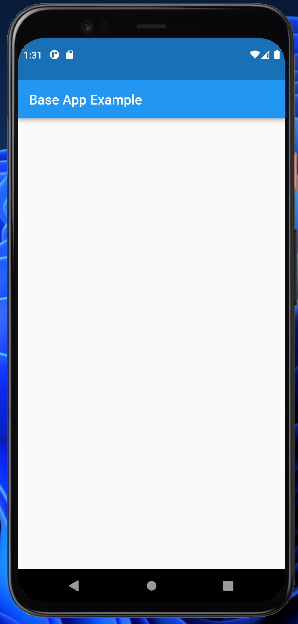
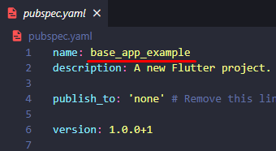
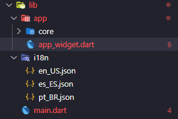
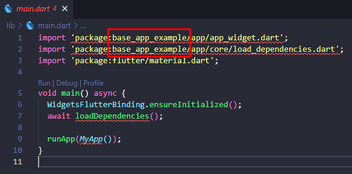

#  📝 COMO COMEÇAR - PLATAFORMA DE APPS

Este tutorial irá descrever como utilizar a Plataforma de Apps de Intelbras em 3 seções: Como criar um base app, Como criar um micro app e Comunicação entre micro apps e internacionalização.

Para utilizar a plataforma e criar projetos nela é necessário ter acesso ao grupo do GitLab [Plataforma Apps][link-plataforma-apps], uma vez com o acesso e as permissões necessárias, siga o tutorial.

## 🚀 Como criar um base app. 
Nesta seção será descrito como criar um base app para um novo projeto.

1. Crie um fork do [Base App Example][link-plataforma-apps]
Lembre-se de dar ao fork o nome desejado para o novo projeto.

2. Faça o clone do fork para sua máquina.

3. Abra o projeto em uma IDE de sua preferência

    Neste tutorial utilizaremos o  [Visual Studio Code][link-visual-studio-code]

4. Baixe as dependências do projeto.
    
    Para baixar as dependências utilize o seguinte comando: `flutter pub get`

5. Executar o app para verificar se ocorreu tudo bem.

    Em caso positivo, está tela deverá ser exbida.

    

    Nesse ponto você tem uma estrutura genêrica de base app, vamos para as personalizações.

6. No arquivo pubspec.yaml altere o atributo name para o nome desejado para o seu projeto.
   
    

7. O passo anterior vai quebrar alguns imports do projeto, para consertar basta ir nos arquivos e substituir o antigo nome do projeto pelo novo.

    

    

    Uma vez corrigidos, você terá um base app pronto para utilizar micro apps.

## 📱 Como criar um micro app.

## 💡 Comunicação entre micro apps e internacionalização.

[link-plataforma-apps]: https://git.intelbras.com.br/PlataformaApps
[link-base-app-example]: https://git.intelbras.com.br/PlataformaApps/base_app_example
[link-visual-studio-code]: https://code.visualstudio.com/